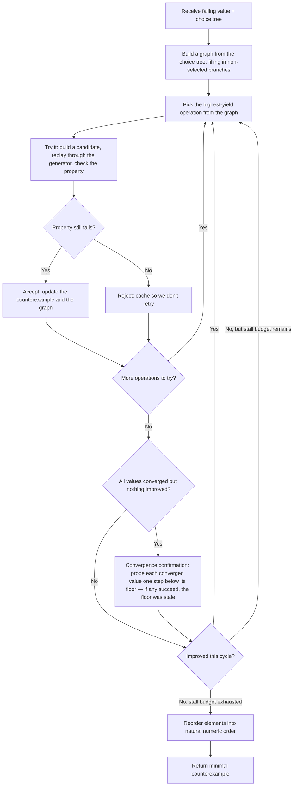

# Reducer Pipeline

*Last updated: 2026-04-12*

When Exhaust finds a failing test case, the reducer shrinks it to a minimal counterexample. It builds a graph from the choice tree — a structural map of every decision the generator made — then tries operations that make the counterexample smaller or simpler while keeping the property failing. Structural operations (delete elements, collapse recursion levels, swap branches) compete with value operations (binary search toward zero, redistribute between coupled parameters) in a shared priority queue. The highest-yield operation wins at each step.

The reducer runs in cycles. Each cycle pulls operations from the graph until all sources are exhausted, then checks whether anything improved. If values have all converged and no structural progress was made, it exits early. Otherwise it decrements a stall budget and tries again.

## What the reducer tries

The graph identifies which operations are available and estimates how much each one would shrink the counterexample. Ten encoders compete in the priority queue each cycle:

| Encoder | What it does |
|---|---|
| **Deletion** | Remove elements from sequences. Tries batch removal first (halving, quartering, cross-sequence), then per-element, then aligned removal across siblings. |
| **Migration** | Move elements from earlier sequences into later ones to enable further deletion. |
| **Substitution** | Replace a subtree with a smaller one from the same recursive generator, or promote a descendant pick to replace its ancestor. |
| **Branch pivot** | Try selecting a different branch at a pick site, using a minimized version of the alternative. |
| **Value search** | Drive each integer value toward its simplest form through interpolation, binary search, and linear scan phases. |
| **Float search** | Drive each floating-point value toward zero using IEEE 754 bit pattern ordering, with the same interpolation → binary → linear progression. |
| **Lockstep** | Search pairs of coupled values in coordinated steps when independent search on either stalls. |
| **Redistribution** | Shift value between type-compatible parameters to find a simpler combination. |
| **Sibling swap** | Swap adjacent sibling elements to improve shortlex ordering. Results may be overridden by the numeric reorder pass. |
| **Bound value search** | Joint search over a controlling value and its dependent subtree or values. Each upstream candidate triggers a full downstream exploration. Deferred to stall cycles. |

After the cycle loop completes, two more encoders run:

| Encoder | What it does |
|---|---|
| **Convergence confirmation** | Probes each converged value one step below its floor. If any succeed, the floor was stale and the cycle loop re-enters. |
| **Numeric reorder** | Sorts sibling elements into ascending numeric order. The reducer works in shortlex order internally, which is consistent but not intuitive to read — this converts to the ordering a user would expect. |

## Design principles

- **No fixed phases.** Structural and value operations compete in a shared priority queue, so the reducer naturally prioritizes big structural cuts early and fine value tuning late.
- **In-place graph mutation.** Accepted changes update the graph directly. Full rebuilds only happen when the structure changes (nodes added or removed).
- **Rejection caching.** Structural replacements (branch pivots, substitutions) are value-independent, so a rejection is cached by identity alone and persists across value changes. Deletions depend on values and use a finer-grained cache.
- **Lazy rematerialization.** Non-selected branch content is only computed when an encoder actually needs it.
- **Convergence tracking.** Once a value search converges, the floor is recorded and reused as a warm start if values shift later. Leaves at their floor are skipped.
- **Stall-cycle gating for expensive operations.** Bound value search (joint search across dependent parameters) only fires when cheaper operations have stalled.
