# Exhaust Pipeline

*Last updated: 2026-03-31*

This diagram shows what happens when you run `#exhaust` with a generator and a property. Exhaust first tries to systematically cover the generator's parameter space using structured coverage. If the generator isn't analyzable, or coverage doesn't find a failure, it falls back to random sampling. When a failure is found, the Bonsai reducer shrinks it through alternating phases of structural and value minimization, guided by an adaptive scheduler that skips unproductive phases and re-checks when conditions change. The result is a minimal counterexample reported back to the test.

```mermaid
flowchart TD
    A["#exhaust { gen, property }"] --> C{"Generator analyzable? (no branching, no deep bind chains)"}

    C -->|"Yes"| D["Analyze generator: run generator, walk the choice tree to extract independent parameters"]
    C -->|"No"| H

    D --> E{"Domain size?"}
    E -->|"All params have 256 values or fewer"| F["Finite domain: enumerate all values per parameter"]
    E -->|"Some large domains"| G["Boundary domain: synthesize interesting boundary values for each parameter by type"]

    F --> COV["Structured coverage: pull-based density algorithm, lazily emit rows, test property (captures value + choice tree per row)"]
    G --> COV

    COV --> COV_R{"Coverage result?"}
    COV_R -->|"Failure found"| COV_REFLECT
    COV_R -->|"Exhaustive pass"| PASS["Property passed (entire space tested)"]
    COV_R -->|"Partial or not applicable"| H

    COV_REFLECT["Best-effort 'reflect' to enrich coverage tree with unselected branches needed by reducer"] --> SCHED

    H["Random sampling: PRNG-driven generation (captures value + choice tree per iteration)"] --> I{"Property fails?"}
    I -->|"No, budget exhausted"| PASS2["Property passed"]
    I -->|"Yes"| SCHED

    subgraph REDUCE ["Bonsai Reducer: receives failing value + choice tree"]
        direction TB
        SCHED["Schedule reduction"] --> BRANCH

        BRANCH["Branch projection: at every pick site, try the shortlex-simplest branch alternative. Batch probe, then binary search over subsets on failure."] --> PROJ

        PROJ["Free coordinate projection: zero out all positions that no structural decision depends on"] --> BD

        subgraph CYCLE ["Cycle loop, until convergence or stall budget exhausted"]
            direction TB
            BD{"Structural work available and prior cycle productive?"} -->|"Yes"| BD_RUN
            BD -->|"No, skip"| FD

            BD_RUN["Base descent: promote and reorder branches, delete contiguous spans, reduce bind-inner values"] --> FD

            FD["Fibre descent: coordinate descent over dependency graph, binary search, linear scan, zero-value encoders, shortlex sibling reordering"] --> EXP_GATE

            EXP_GATE{"Prior cycle edges not all exhausted clean, and no earlier phase accepted?"} -->|"Yes"| EXP
            EXP_GATE -->|"No, skip"| RLX_GATE

            EXP["Exploration: compose multi-step reductions, escape local minima"] --> RLX_GATE

            RLX_GATE{"Coupled coordinates detected, or no earlier phase accepted?"} -->|"Yes"| RLX
            RLX_GATE -->|"No, skip"| PROBE

            RLX["Relax round: temporarily worsen then re-descend, escape coupled dependencies"] --> PROBE

            PROBE{"Base descent was skipped and deletion targets exist?"} -->|"Yes"| PROBE_RUN
            PROBE -->|"No"| CONV

            PROBE_RUN["Deletion probe: lightweight structural pass to check if value changes enabled new deletions"] --> CONV

            CONV{"Improved? (shortlex order)"}
            CONV -->|"Yes, reset stall budget"| BD
            CONV -->|"No"| CONV2{"All value coordinates converged?"}
            CONV2 -->|"Yes, fixed point reached"| DONE
            CONV2 -->|"No, decrement stall budget"| STALL{"Stall budget exhausted?"}
            STALL -->|"No"| BD
            STALL -->|"Yes"| DONE
        end

        DONE["Human-readable ordering: reorder elements into natural numeric order"]
    end

    DONE --> REPORT

    REPORT["Render failure: shrunk counterexample, diff from original, replay seed, invocation count"] --> ISSUE["Report failure back to the test, return minimal counterexample"]
```

