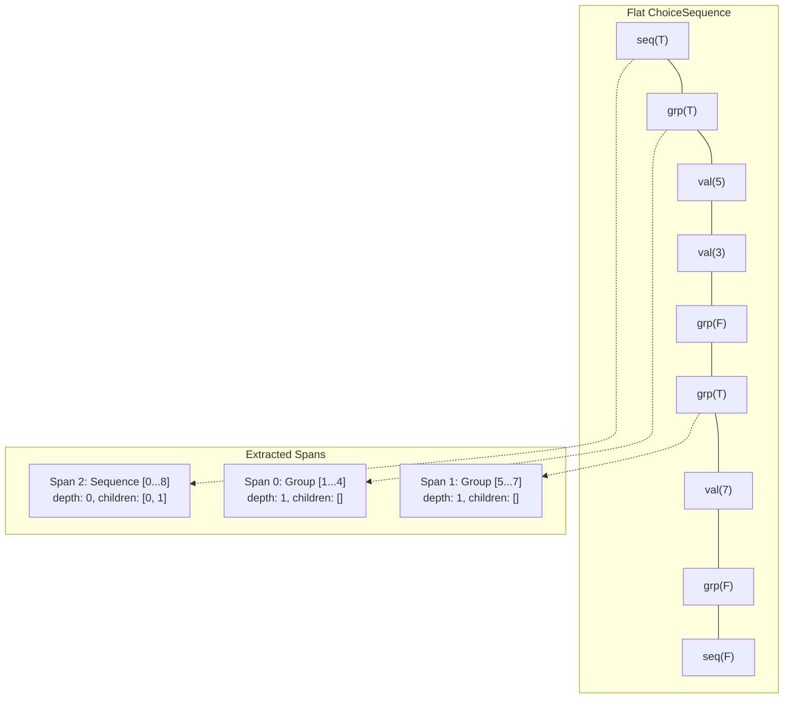
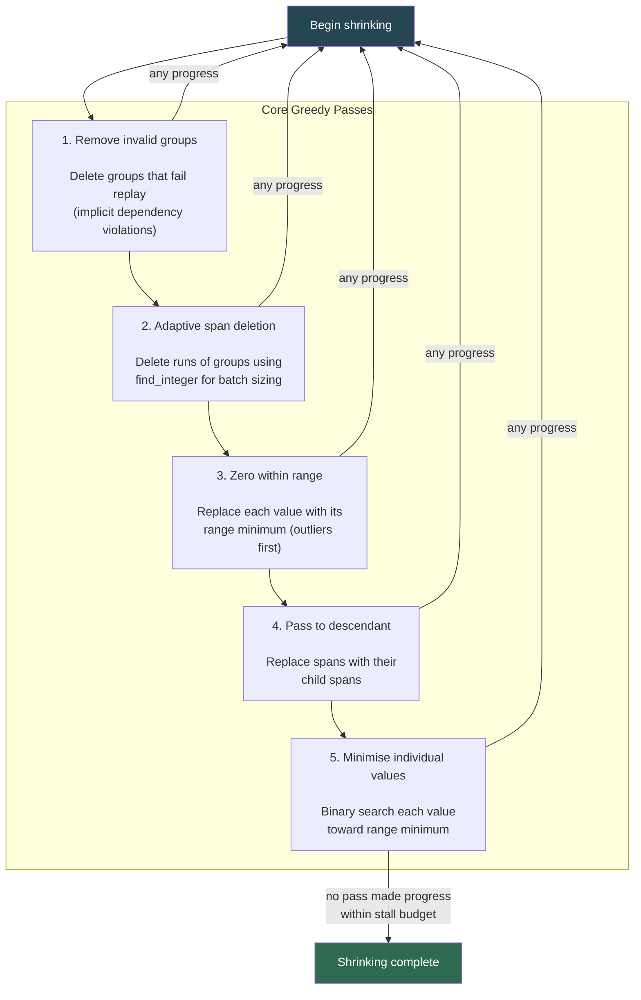
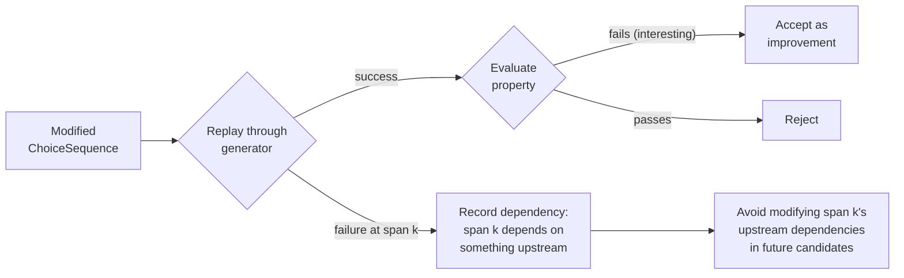
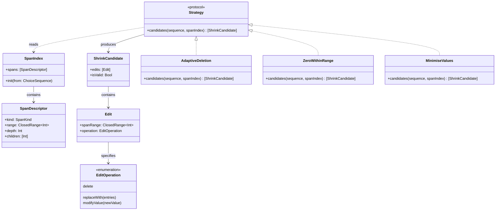
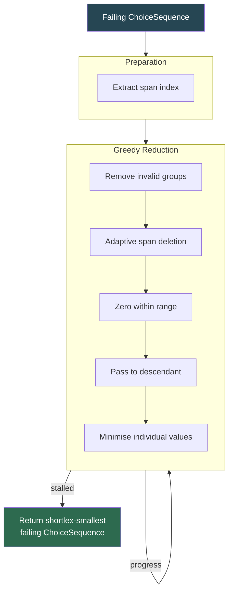
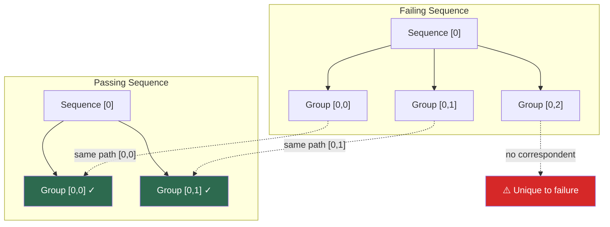
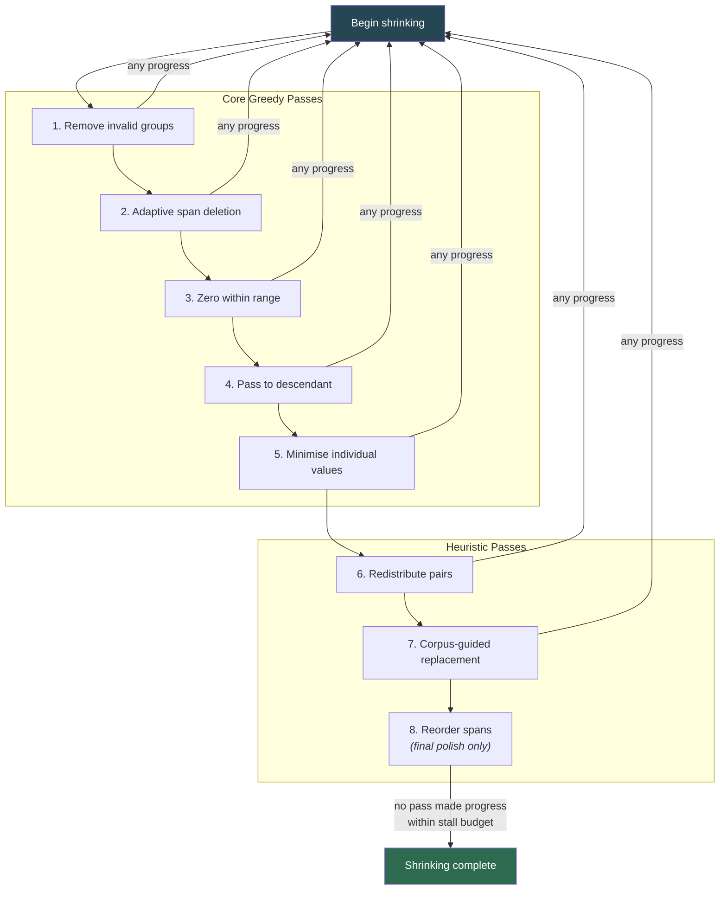
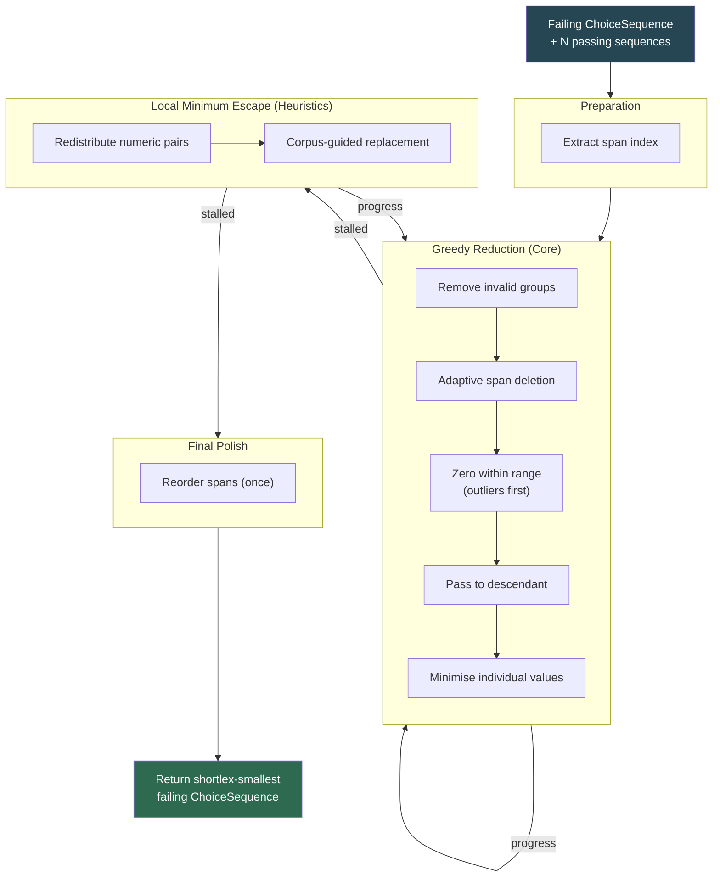

# Adaptive Shrinking for Property-Based Testing

## A Hybrid Approach Combining Hypothesis-Inspired Internal Reduction, Corpus-Guided Heuristics, and Structural Alignment

---

This document is organised in three layers, designed to be implemented and validated incrementally:

1. **Core Algorithm** (§1–7) — Greedy shortlex reduction with `find_integer` and `binary_search_with_guess`, with empirical range metadata driving priority ordering and search guesses. This alone handles the overwhelming majority of real-world shrinking.
2. **Heuristics** (§8–12) — Structural alignment, corpus-guided replacement, and local minimum escape. These improve shrink quality for edge cases.
3. **Worked Example and Prior Work** (§13–15) — Demonstrates the full algorithm and situates it in the literature.

A separate **Addendum** covers profile-driven acceleration: SIMD pre-filtering, allocation elimination, parallelism, and speculative population-level restart. These should only be implemented once profiling demonstrates they are warranted.

---

# Part 1: Core Algorithm

## 1. Introduction and Problem Statement

Property-based testing (PBT) works by generating random instances of a system under test (SUT) and checking whether a given property (an opaque predicate `? → Bool`) holds for each instance. When the property fails, the framework has a failing input — but that input is typically large, messy, and difficult to debug. **Shrinking** is the process of finding the smallest, simplest input that still triggers the same failure.

This document describes a shrinking algorithm designed for a Swift PBT framework that represents generated values as a **`ChoiceTree`** (a structured tree of generation decisions) which is projected into a flat **`ChoiceSequence`** (a linear array of typed values with structural markers). The core algorithm draws primarily on **Hypothesis's internal reduction** (MacIver & Donaldson, 2020) — shortlex optimisation over choice sequences using generator-directed reduction passes — extended with corpus-guided heuristics and structural alignment techniques.

### 1.1 Design Goals

The algorithm prioritises:

- **Shrink quality** — finding the smallest possible failing input.
- **Performance** — sub-millisecond oracle evaluations mean the bottleneck is candidate generation, not evaluation.
- **Simplicity** — the core is a greedy pass-based loop with a single adaptive probe. Complexity is added only where profiling justifies it.
- **Local minimum avoidance** — escaping basins of attraction where no single greedy step improves the result, handled by heuristic passes rather than heavyweight population dynamics.

### 1.2 The ChoiceSequence Representation

A `ChoiceSequence` is a flat array of `SequenceValue` entries. Each entry is one of four cases:

| Entry | Purpose |
|---|---|
| `group(Bool)` | `true` opens a group (product-type structure or list element), `false` closes it |
| `sequence(Bool)` | `true` opens a sequence (repeated/collection structure), `false` closes it |
| `branch(Value)` | A branching choice — the `Value` contains the chosen index. Range is always `0..<branchCount`. **No closing marker** — the enclosing group or sequence provides the structural boundary. |
| `value(Value)` | A leaf value — a concrete generated value consumed by the generator. |

Both `branch` and `value` carry the same `Value` type, which includes: concrete type (unsigned, signed, float, character), valid range, **empirical range**, and **empirical centroid**. The distinction between `branch` and `value` is in how the generator and shrinking passes interpret them, not in the data representation.

`group` and `sequence` are paired markers — every `group(true)` has a corresponding `group(false)`, forming a span. `branch` is a **point entry** — it sits inside a span alongside the associated values for the chosen branch, and the enclosing markers determine its structural scope.

Each `Value` carries empirical statistics populated by the generator from the passing corpus before shrinking begins:

- The **valid range** is the declared range of the value's type (e.g., `0...120` for an age field). This is structural — it reflects what the generator *could* produce. For branch discriminators, this is always `0..<branchCount`.
- The **empirical range** is the observed min/max of values at this position across the passing corpus (e.g., `3...17`). This reflects what the generator *actually* produced in passing cases.
- The **empirical centroid** is the midpoint of the empirical range: `(empiricalMin + empiricalMax) / 2` (e.g., `10`). This is the algorithm's best estimate of where "normal" values live. It is distinct from the midpoint of the valid range (`60` for `0...120`), which carries no distributional information.

The empirical centroid is the value supplied as the **guess** to `binary_search_with_guess` (§3.2) during value minimisation. Because it reflects the distribution of passing cases rather than the raw type range, it tends to be close to the answer for values that aren't failure-relevant — reducing the search cost from O(log(range)) to O(log(|centroid − answer|)), which often approaches O(1).

The shrinking algorithm reads these statistics directly from each value entry without cross-sequence alignment or positional computation.

**Example:** A generator that produces a `Shape` (a sum type: circle, rect, or triangle) inside a `Drawing` with a label might produce:

```
group(true)              ← Drawing
  group(true)            ← label
    value("S")           ← character, range: a...z, empirical: a...t, centroid: j
    value("k")           ← character, range: a...z, empirical: a...p, centroid: h
  group(false)
  branch(2)              ← Shape discriminator, range: 0..<3, chose triangle
  group(true)            ← triangle associated values
    value(3.5)           ← side a, float, range: 0...100, empirical: 1...20, centroid: 10
    value(7.1)           ← side b, float, range: 0...100, empirical: 1...20, centroid: 10
    value(2.9)           ← side c, float, range: 0...100, empirical: 1...20, centroid: 10
  group(false)
group(false)
```

Debug format: `((B2:V:V)(V:V:V))`

Pass 3 tries zeroing the `branch(2)` entry to `branch(0)` — taking the circle branch instead. The generator replays, consuming only one value (radius) from the subsequent data, producing `.circle(radius: 3.5)`. The remaining values are orphaned and truncated. If this still fails the property, the sequence is now shorter and the discriminator is smaller — a significant shortlex improvement.

In this example, the side values (3.5, 7.1, 2.9) all fall within their empirical range (1...20), so they are low-priority targets for Pass 3 zeroing. The branch discriminator at index 2 (with only 3 branches) is tried first as the highest-leverage structural change.

### 1.3 Available Context

Before shrinking begins, the framework has already run N test cases (typically 100+) that **passed** the property, plus one that **failed**. The passing corpus's statistical information — empirical ranges and centroids — is already encoded in each `value` entry's metadata. The shrinking algorithm reads this directly from the sequence without any corpus analysis step. The passing corpus itself is retained for corpus-guided group replacement (§10.3).

---

## 2. Foundational Concepts

### 2.1 Shortlex Ordering

Following Hypothesis, the fundamental ordering over choice sequences is **shortlex**: sequence A is "better" (simpler) than sequence B if A is shorter, or if they have the same length and A is lexicographically smaller (interpreting each value as its ordinal position within its valid range).

This ordering is natural because:

- **Shorter sequences produce smaller generated values.** Fewer generation decisions generally means less structure in the output.
- **Lexicographically smaller values tend toward zero** (or range minimums), which typically produces simpler, more readable outputs.
- **Earlier choices are prioritised**, which biases toward simpler structural decisions (e.g., choosing a simpler branch at a sum type).

### 2.2 Spans as the Core Abstraction

Every meaningful region of the `ChoiceSequence` is a **span** — a `ClosedRange<Int>` from an open marker to its corresponding close marker, inclusive. Spans nest: a group span contains value entries and possibly nested group spans; a sequence span contains group spans.

A single O(n) linear pass over the `ChoiceSequence` extracts a **span index** — a flat array of span descriptors. Because inner spans close before outer spans, the resulting array is in leaves-first order, which is natural for bottom-up shrinking.



### 2.3 Edit Operations

All manipulations of the `ChoiceSequence` are expressed as **edits** targeting non-overlapping spans:

| Operation | Description |
|---|---|
| **Delete span** | Remove everything in the span including its markers |
| **Replace span** | Swap the contents of a span with a new subsequence |
| **Modify value** | Change a single value within its valid range |

A **shrink candidate** is a list of non-overlapping edits. Non-overlapping edits commute (their application order doesn't matter) and can be validated independently. In Swift, multiple simultaneous deletions are applied using `RangeSet` and `Array.removeSubranges(_:)`, which handles all index bookkeeping in a single pass.

---

## 3. The Adaptive Probes: `find_integer` and `binary_search_with_guess`

Two closely related algorithms form the backbone of every shrink pass. Both originate from Hypothesis (MacIver & Donaldson, 2020), with `binary_search_with_guess` described in MacIver's ["Improving Binary Search by Guessing"](https://notebook.drmaciver.com/posts/2019-04-30-13:03.html). They share a key property: their cost is logarithmic in the size of the *output* (or the error of the guess), not the size of the input range. They either give you a large result or cost very little.

### 3.1 `find_integer`

Discovers the **largest** k for which a predicate holds, in O(log k) time. Used wherever a pass needs to find "how many of these can I do at once."

```
find_integer(f):
    // f(0) is assumed true, not checked
    // Linear scan for small results (can't win big on tiny inputs)
    for i in 1...4:
        if not f(i): return i - 1

    // Exponential probe upward
    lo = 4
    hi = 8
    while f(hi):
        lo = hi
        hi = hi * 2

    // Binary search between lo and hi
    while lo + 1 < hi:
        mid = (lo + hi) / 2
        if f(mid): lo = mid
        else: hi = mid

    return lo
```

### 3.2 `binary_search_with_guess`

A binary search where you supply a **guess** of the answer. The cost is O(log(|guess − answer|)) rather than O(log(hi − lo)). If the guess is good, this approaches O(1). If the guess is maximally wrong, it costs at most 2× a standard binary search — a bounded downside for a potentially large upside.

The algorithm uses `find_integer` internally: starting from the guess, it probes outward (exponentially, then binary search) to find the boundary.

```
binary_search_with_guess(f, lo, hi, guess):
    // Find n such that lo <= n < hi and f(n) != f(n + 1).
    // f(lo) is assumed to differ from f(hi).
    // guess is a prediction of n. Runs in O(log(|guess - n|)).

    if guess is nil: guess = lo
    assert lo <= guess < hi

    good = f(lo)

    if f(guess) == good:
        // Guess was on the same side as lo — search upward from guess
        k = find_integer { k in guess + k < hi and f(guess + k) == good }
        return guess + k
    else:
        // Guess was on the same side as hi — search downward from guess
        k = find_integer { k in guess - k >= lo and f(guess - k) != good }
        return guess - k - 1
```

The key insight from MacIver is that **any information you have about the likely answer can be encoded as a guess**, converting domain knowledge into reduced oracle calls without changing the algorithm's structure or correctness guarantees.

### 3.3 Application to Shrink Passes

The two probes serve complementary roles:

**`find_integer`** is used wherever the question is "how many of these can I do at once" — batch sizing with no prior expectation of the answer. Adaptive span deletion is the canonical example:

```
i = 0
while i < spans.count:
    // Find the largest k such that deleting spans[i..<i+k] still fails
    k = find_integer { k in
        candidate = sequence.removingSpans(i..<i+k)
        return oracle(candidate) == .failing
    }
    if k > 0:
        sequence.removeSpans(i..<i+k)
    else:
        i += 1
```

This never does substantially more work than naive one-at-a-time deletion, but can achieve huge batch deletions (e.g., removing 50 consecutive list elements) in O(log 50) oracle calls instead of 50.

**`binary_search_with_guess`** is used wherever the question is "what is the smallest value that still triggers the failure" — value minimisation where the empirical centroid provides a good guess. See Pass 5 (§4.2) for details.

---

## 4. Core Shrink Passes

The core algorithm is organised as a sequence of **passes**, each performing a class of transformation. Passes run in fixed priority order. Whenever any pass makes progress (finds a shortlex-smaller failing sequence), control resets to the top of the pass list. A stall counter terminates the process if no pass has made progress within a budget.

### 4.1 Pass Ordering



### 4.2 Pass Descriptions

#### Pass 1: Remove Invalid Groups

Delete groups whose replay fails — not because the property passes, but because the generator itself can't consume the sequence (an implicit dependency violation). Mark the group boundary where failure occurred. Over successive generations, this builds a partial dependency map that helps avoid generating doomed candidates later.

**Dependency tracking is per-generation:** reset the dependency map after each successful shrink, since the dependency structure may have changed along with it. This is the aggressive strategy — it costs more oracle calls than treating groups as permanently undeletable, but finds deeper minima.

#### Pass 2: Adaptive Span Deletion

The highest-value pass. Iterate over spans from outermost to innermost. At each span, use `find_integer` to try deleting the largest possible contiguous run of spans starting from the current position. Accept any deletion that produces a shortlex-smaller sequence that still fails the property.

#### Pass 3: Zero Within Range

For each `value` and `branch` entry, try replacing it with the minimum of its valid range (zero for `branch` discriminators, typically zero for unsigned integers). If the result is still a failing sequence and is shortlex-smaller, accept it.

Zeroing a `branch` discriminator is the highest-leverage single change in the entire algorithm — it forces the generator to take the first (simplest) branch during replay, which often eliminates associated values from the sequence entirely. A triangle becoming a circle removes two values in one oracle call.

**Priority ordering:** Branch discriminators are tried first (highest structural leverage), then outlier `value` entries — those whose current value falls outside the empirical range — then remaining values. This costs nothing beyond checking entry type and reading the empirical range field, and focuses effort on the changes most likely to produce large shortlex improvements.

#### Pass 4: Pass to Descendant

For each span that contains child spans, try replacing the parent span with each child span individually. This collapses nested structure: if a group contains a single nested group, the outer wrapper may be removable.

In the binary tree analogy from MacIver & Donaldson: this pass replaces a branch node with one of its subtrees.

#### Pass 5: Minimise Individual Values

For each `value` entry, find the smallest value within the valid range that still triggers the failure. This is the natural application of `binary_search_with_guess` (§3.2): the search range is [range minimum, current value], and the **guess** is the empirical centroid from the value's metadata.

For `branch` discriminators, use a linear scan of lower branch indices rather than `binary_search_with_guess`. Branch counts are typically small (2–10 cases for most sum types), and each branch index produces a structurally different replay — there's no continuity assumption that makes binary search meaningful. Try each index from 0 up to the current value, stopping at the first that still fails the property.

```
for each value v in sequence:
    if v.current == v.rangeMinimum: continue
    n = binary_search_with_guess(
        f: { candidate_value in oracle(sequence.replacing(v, with: candidate_value)) == .failing },
        lo: v.rangeMinimum,
        hi: v.current,
        guess: v.empiricalCentroid
    )
    sequence.replace(v, with: n)
```

When the failing value is 247 and the empirical centroid is 12, the cost is O(log(|12 − answer|)). If the value isn't failure-relevant and the answer is near the centroid (the common case), this approaches O(1). If the value *is* failure-relevant and the answer is far from the centroid, the cost is at most 2× what plain binary search would have paid — a bounded downside.

**Successive iterations benefit further.** After a successful structural shrink (e.g., a group deletion in Pass 2), values may need re-minimisation. A good guess for the re-minimisation is the value found in the previous iteration, since structural changes elsewhere typically shift the boundary only slightly. The cost of re-minimising becomes O(log(delta)) where delta is how much the boundary moved, rather than O(log(range)).

For **float** values, also try rounding toward simpler representations (whole numbers, then halves, then quarters). Type metadata enables this directly without Hypothesis's dedicated float pass.

### 4.3 Type-Aware Shrinking Targets

The concrete type metadata on each value enables targeted shrinking within the core passes:

| Type | Shrinking strategy |
|---|---|
| **Branch discriminator** | Pass 3: try index 0. Pass 5: linear scan of lower indices (branch counts are small; each index produces structurally different replay). |
| **Unsigned integer** | `binary_search_with_guess` toward range minimum, guessing the empirical centroid. |
| **Signed integer** | `binary_search_with_guess` toward zero, guessing the empirical centroid. Also try sign flips — a failure at -3 may also fail at 3. |
| **Float** | `binary_search_with_guess` toward zero, then try rounding toward simpler representations (integers, then halves). Special-case denormals, NaN, infinities. |
| **Character** | `binary_search_with_guess` toward `'a'` or NUL depending on context. |

---

## 5. Handling Implicit Dependencies

### 5.1 The Replay Problem

The `ChoiceTree` is constructed by a user-written generator. Some generators have implicit dependencies: the valid range of choice B depends on the value chosen for choice A, but this dependency is not declared in the `ChoiceSequence` metadata. When a candidate sequence is replayed through the generator, it may fail not because the property passes, but because the generator itself can't consume the modified sequence.

### 5.2 Learning from Replay Failures

When a candidate fails replay (as opposed to failing the property), record which span boundary the failure occurred at. Over successive generations, this builds a partial dependency map:



---

## 6. Composable Strategy Architecture

### 6.1 Strategies as Functions

Each shrink strategy is a pure function from a `ChoiceSequence` and its span index to a collection of edit descriptors. Strategies are stateless, independent, and composable.



### 6.2 Composing Strategies

Strategies compose in two ways:

**Union composition:** Run two strategies independently, collect all candidates into a single pool. Each candidate is evaluated separately.

**Product composition:** Take candidates from strategy A and candidates from strategy B, merge them pairwise wherever their edits don't overlap. If A proposes deleting the group at span [3,8] and B proposes reducing the value at span [15,15], the merged candidate does both simultaneously. Skip any pairs that overlap.

Overlap detection uses `RangeSet`: if the union of two candidates' edit ranges differs from their sum, they overlap and the pair is discarded.

---

## 7. Complete Core Algorithm Flow



The core algorithm is three nested loops:

1. **Outer loop (stall detection):** Run passes in priority order. Reset to the top whenever any pass makes progress. Terminate when no pass makes progress within the stall budget.

2. **Inner loop (per-pass):** Within each pass, generate candidates as span-aligned edit descriptors. Evaluate each. Accept the shortlex-smallest successful candidate.

3. **Innermost (adaptive probes):** Within each pass iteration, `find_integer` discovers the largest effective batch operation in O(log k) oracle calls; `binary_search_with_guess` minimises individual values in O(log(|guess − answer|)) oracle calls using the empirical centroid as the guess.

This core is sufficient for the vast majority of real-world shrinking. The heuristic layer adds techniques for edge cases where greedy reduction stalls.

---

# Part 2: Heuristics

## 8. Structural Identity and Alignment

### 8.1 The Identity Problem

Two `ChoiceSequence`s from the same generator will have structurally similar regions, but markers carry no identity. Group 3 in sequence A and group 3 in sequence B might represent completely different generator paths. To swap groups between sequences (for corpus-guided replacement), you need a way to establish correspondence.

### 8.2 Structural Path as Identity

For each span in the span index, compute a **path key** — the sequence of sibling indices from root to that span. During span extraction, each span that closes registers itself as a child of its parent frame; its sibling index is the count of children already registered in that frame.

Two spans in different `ChoiceSequence`s with the same path key are **structurally corresponding** — they were produced by the same nesting decisions in the generator.



### 8.3 Handling Variable-Width Structures

Path-based alignment breaks down when the generator emits a variable number of children based on an earlier choice (e.g., generate N, then emit N groups). When sibling counts differ, fall back to a greedy longest-common-subsequence match over child types at that level. This is cheaper than full Levenshtein edit distance and sufficient for establishing which children were inserted, deleted, or preserved.

---

## 9. Structural Distance

### 9.1 Constructing Structural Signatures

Collapse each group span into a single token representing its kind (ignoring the values inside). Collapse each sequence into its ordered list of child tokens. The resulting signature is short (trees are typically narrow and shallow) and captures the structural shape of the choice sequence.

**Example:**

```
Full sequence:  seq(T) grp(T) val(5) val(3) grp(F) grp(T) val(7) grp(F) seq(F)
Signature:      S(G, G)
```

### 9.2 Distance Metric

For measuring structural similarity, use **Jaccard distance** over the multiset of child-type tokens rather than full Levenshtein edit distance. Jaccard is O(n) in the signature length, requires no DP table, and answers the questions actually being asked:

- **Donor selection:** "Which passing sequence is structurally closest to the failing sequence?" Jaccard over token multisets provides a good ranking with minimal computation.
- **Diversity checking (if archive/restart is implemented — see Addendum D):** "Is this candidate structurally different enough from existing entries?" Jaccard distance exceeding a threshold is a clean, cheap test.

For the specific case of donor selection where you need to know *which* children map to which (not just overall similarity), use the greedy LCS match from §8.3 rather than Levenshtein. The edit script from LCS tells you which groups to try deleting, inserting, or replacing.

---

## 10. Heuristic Passes

These passes extend the core pass list. They run at lower priority — after all core passes have stalled — and any progress they make resets control to the top of the full pass list (core passes first).

### 10.1 Pass Ordering (Complete)



### 10.2 Pass 6: Redistribute Pairs

Find two nearby numeric values and try redistributing their sum. If values at positions i and j sum to S, try (S, 0) and (0, S) and various splits. The total stays the same but one value may become zero, enabling its group to be deleted by a subsequent core pass.

**This is the primary local minimum escape mechanism for value-level minima.** It doesn't improve the shortlex key directly, but unlocks further structural reductions.

### 10.3 Pass 7: Corpus-Guided Group Replacement

Using the structural path alignment from §8.2, replace groups in the failing sequence with their corresponding groups from the closest passing sequence (by Jaccard distance over structural signatures). If the result still fails, the replaced group doesn't contribute to the failure and can be simplified to its passing-corpus equivalent.

If the result passes, the replaced group **is** involved in the failure — mark it as failure-relevant and focus further shrinking on it.

### 10.4 Pass 8: Reorder Spans

Try swapping adjacent sibling spans if doing so produces a lexicographically smaller sequence. This doesn't change the length and produces only cosmetic shortlex improvement.

**This pass runs once, at the end, as a final polish.** It is not included in the progress-triggered reset cycle — progress from reordering does not restart the pass list. The improvement is marginal (only affects sequences of equal length that differ in ordering) and the O(n²) worst case in sibling span count is not justified on every cycle.

---

## 11. Complete Algorithm Flow (Core + Heuristics)



---

## 12. Swift Implementation Considerations

These are language features that improve correctness and performance of the core and heuristic layers without adding algorithmic complexity.

### 12.1 Ownership Annotations (SE-0377)

Mark `ChoiceSequence` parameters as `borrowing` in strategy functions to let the compiler enforce that no implicit copies occur. For the oracle replay path, `consuming` the candidate sequence elides the copy when the caller doesn't need the value afterwards. These annotations are available in Swift 5.9+ and provide copy-elimination guarantees without the `~Escapable` choreography that `Span` requires.

### 12.2 Non-Copyable Types (SE-0390)

`ShrinkCandidate` is a natural `~Copyable` type. Candidates are generated, evaluated once, then either accepted or discarded. Making `ShrinkCandidate` non-copyable prevents accidental retain cycles and lets the compiler reason about the single-owner lifecycle. The accepted candidate is `consume`d into the new sequence; rejected candidates are dropped without ceremony.

### 12.3 Typed Throws (SE-0413)

The oracle and replay can fail in distinct ways — replay failure (generator can't consume the sequence), property pass, property fail. Typed throws distinguish these at the type level without boxing into an existential `Error`:

```swift
enum ReplayOutcome: Error {
    case replayFailed(atSpan: Int)
    case propertyPassed
}

func evaluate(_ candidate: borrowing ChoiceSequence) throws(ReplayOutcome) -> ChoiceSequence { ... }
```

This matters in the tight inner loop where existential allocation is exactly what you're trying to avoid.

### 12.4 Package Access Control

Structure the framework as a Swift package. Strategies that need access to `ChoiceSequence` internals (backing storage, span index) use `package` visibility, keeping the public API surface clean without `@testable` or friend patterns.

### 12.5 Structured Concurrency for Candidate Evaluation

`withTaskGroup` is the natural fit for within-pass parallelism: "evaluate N candidates, take the best result." It handles cancellation automatically (cancel remaining evaluations once a strictly-better-than-current-best result is found), provides structured lifetime management, and cooperates with the Swift runtime for core scheduling.

```swift
let best = await withTaskGroup(of: EvaluationResult?.self) { group in
    for candidate in candidates {
        group.addTask { evaluate(candidate) }
    }
    var best: EvaluationResult?
    for await result in group {
        if let r = result, r.isBetterThan(best) {
            best = r
        }
    }
    return best
}
```

### 12.6 Shared Read-Only State

The passing corpus, empirical ranges, and span index are computed once in Phase 0 and never mutated. Use `nonisolated(unsafe)` with a documented safety argument to share these across tasks without `Sendable` conformance overhead or unnecessary copying:

```swift
nonisolated(unsafe) let empiricalRanges: EmpiricalRanges = computeRanges(corpus)
```

---

# Part 3: Context

## 13. Worked Example

Consider a generator that produces a list of `Person` values, where each person has a name (string) and an age (unsigned integer). The property under test asserts that sorting a list of people by age produces a stable sort.

### 13.1 Initial Failing Sequence

```
sequence(true)                   ← list
  group(true)                    ← person 0
    group(true)                  ← name
      value('Z')  range: a...z
      value('q')  range: a...z
      value('x')  range: a...z
    group(false)
    value(42)     range: 0...120 ← age
  group(false)
  group(true)                    ← person 1
    group(true)                  ← name
      value('M')  range: a...z
      value('b')  range: a...z
    group(false)
    value(42)     range: 0...120 ← age (same age → stability test)
  group(false)
  group(true)                    ← person 2
    group(true)                  ← name
      value('A')  range: a...z
    group(false)
    value(7)      range: 0...120 ← age
  group(false)
sequence(false)
```

### 13.2 Shrinking Trace

**Pass 2 (Adaptive deletion):** Try deleting person 2 (the entire third group). The result still fails — person 2 is irrelevant to the stability bug. The sequence is now shorter.

**Pass 3 (Zero within range):** Try zeroing the name characters. 'Z' → 'a', 'q' → 'a', 'x' → 'a', 'M' → 'a', 'b' → 'a'. All still fail — the names don't matter, only their relative order for stability. The values are now at their range minimums.

**Pass 2 again (triggered by progress):** Try deleting name characters. Each person needs at least one character. The names shrink to single characters. `find_integer` discovers we can delete 2 of person 0's 3 characters in one shot.

**Pass 5 (Minimise values):** `binary_search_with_guess` on the ages, using the empirical centroid as the guess. Both are 42. Try (0, 0) — passes (no stability test with age 0 and 0). Try (1, 1) — fails. Try (0, 1) — passes. The minimal failing ages are (1, 1) — two people with the same age, where the sort is unstable.

**Final result:**

```
sequence(true)
  group(true)
    group(true)
      value('a')
    group(false)
    value(1)
  group(false)
  group(true)
    group(true)
      value('a')
    group(false)
    value(1)
  group(false)
sequence(false)
```

Two people named "a", both age 1. This is the minimal input demonstrating the stability bug.

---

## 14. Relationship to Prior Work

### 14.1 From Hypothesis

| Hypothesis concept | Adaptation |
|---|---|
| Shortlex ordering over choice sequences | Adopted directly as the universal fitness function |
| `start_example`/`stop_example` markers | `group(Bool)`/`sequence(Bool)` paired markers, plus `branch(Value)` as a point entry for sum-type discriminators |
| `find_integer` adaptive probe | Adopted directly; applied to every iterative pass for batch sizing |
| `binary_search_with_guess` (MacIver, 2019) | Adopted for value minimisation; empirical centroid from value metadata provides the guess |
| Generator-directed reduction (draw boundaries) | Span index extracted from structural markers |
| Pass-based architecture with fixation | Adopted with priority ordering and progress-triggered reset |
| `max_stall` budget | Adopted as termination criterion |
| Float special-casing | Replaced by type-aware shrinking using concrete type metadata |
| Shortlex as only ordering | Extended with structural distance as secondary criterion for donor selection |

### 14.2 From Pseudo-Genetic Algorithms (Yasin, Strooper & Steel, 2017)

| Pseudo-GA concept | Adaptation for shrinking |
|---|---|
| General Model (GM) constrains operators | `ChoiceTree` structure (via span markers) constrains edits to structural boundaries |
| Crossover consults GM for valid substitutions | Group replacement uses structural path alignment |
| Mutation operators (insert, swap, delete) | Delete span, modify value, reorder spans |
| Fitness = mutation score | Fitness = shortlex key (inverted — smaller is better) |

### 14.3 Novel Contributions

| Technique | Notes |
|---|---|
| Empirical range metadata per value | Generators populate per-value empirical statistics from the passing corpus; shrinking reads them directly without alignment or computation |
| Empirical centroid as `binary_search_with_guess` hint | Combines MacIver's guess-based search (2019) with intrinsic value metadata for O(log(\|centroid − answer\|)) minimisation |
| Structural distance for donor selection | Application of Jaccard/LCS distance to collapsed structural signatures |
| `RangeSet`-based batch edit application | Use of Swift's `Array.removeSubranges` for composable edit application |
| Composable strategy architecture | Union and product composition of independent strategies |
| Ownership annotations for copy elimination | `borrowing`/`consuming`/`~Copyable` to eliminate allocation on the hot path |
| Typed throws for replay outcomes | Zero-cost error discrimination in the inner loop |

### 14.4 Benchmark Validation: The Shrinking Challenge

The [jlink/shrinking-challenge](https://github.com/jlink/shrinking-challenge) repository collects 11 concrete shrinking problems that expose weaknesses across PBT frameworks. Analysis against this benchmark (see companion document: *The Shrinking Challenge: Benchmark Analysis*) confirms several design decisions:

The core algorithm (Passes 1–6) handles 8 of 11 challenges without heuristic support. The two challenges it cannot solve — **Nested Lists** and **Large Union List** — both require pair redistribution (§11) to escape local minima where deletion alone is trapped. This validates §11's inclusion in the heuristic layer and identifies it as the first heuristic to implement after the core. The remaining challenge (**Distinct**) requires element reordering for consistent normalisation, suggesting a lightweight swap pass may be worth promoting to the core if cross-run determinism is a goal.

Five challenges (Deletion, Length List, Bound5, Coupling, Difference) involve coupling between parameters that type-based shrinkers cannot handle without manual intervention. All five are solved directly by integrated shrinking — operating on the flat choice sequence and replaying through the generator preserves structural invariants by construction. This confirms that integrated shrinking is architecturally necessary, not merely convenient.

---

## 15. Summary

The algorithm can be summarised as two nested loops with a heuristic escape hatch:

1. **Outer loop (pass level):** Run passes in priority order — core passes first, then heuristic passes. Reset to the top whenever any pass makes progress. Stall after a budget of unproductive cycles.

2. **Inner loop (candidate level):** Within each pass, generate candidates as span-aligned edit descriptors. Evaluate sequentially (or in parallel — see Addendum A). Accept the shortlex-smallest successful candidate.

The passing corpus provides statistical priors baked into each value's metadata, focusing effort on outlier values without any alignment or corpus analysis at shrink time. Structural path alignment enables corpus-guided replacement. The two adaptive probes — `find_integer` for batch sizing and `binary_search_with_guess` for value minimisation — ensure every pass is efficient regardless of input size, with cost proportional to the output rather than the search space. Swift ownership annotations and typed throws eliminate allocation from the speculative evaluation path. And the composable strategy architecture means new shrinking techniques can be added without touching existing ones.

---
---

# Addendum: Profile-Driven Acceleration

The techniques in this addendum should only be implemented after the core and heuristic layers are working and profiled on real-world generators. Each section includes a **gate criterion** — the profiling result that justifies implementation.

---

## A. Within-Pass Parallelism

**Gate criterion:** Profiling shows that oracle evaluation time dominates candidate generation time for your typical sequence lengths. If the oracle is truly sub-millisecond and sequences are short, the structured concurrency dispatch overhead may exceed the parallelism benefit.

### A.1 Candidate-Level Parallelism

Generate all single-group-deletion candidates simultaneously. Evaluate in parallel using `withTaskGroup`. Accept the shortlex-smallest successful candidate.

This is the only level of parallelism that composes cleanly with the pass-priority-with-reset architecture. Across-pass parallelism (running different passes on different cores simultaneously) conflicts with the reset mechanism — if one pass makes progress, work on other passes must be invalidated. The coordination cost is unlikely to be recovered for sub-millisecond oracles.

### A.2 Hybrid Materialisation

`Span`'s `~Escapable` constraint means `Span` values cannot be stored in a candidate collection and handed off to a parallel evaluator. Use a hybrid approach: generate candidates as lightweight edit descriptors (stack-allocated), then materialise only the candidates dispatched to the parallel evaluator. Candidate *generation* remains allocation-free; the copy cost is paid only for candidates that actually get evaluated.

Given a sub-millisecond oracle, the sequential path may outperform the parallel path for small-to-medium sequences, because allocation and dispatch overhead exceeds oracle cost. The crossover point depends on sequence length and core count. Profile both.

---

## B. SIMD Pre-Filtering and Zero-Check Scanning

**Gate criterion:** Profiling shows that a significant proportion of oracle calls are wasted on candidates that could have been statically determined to be shortlex-dominated, or on values already at their range minimum.

### B.1 Shortlex Pre-Filtering

Before invoking the oracle, candidates guaranteed to be shortlex-larger than the current best can be rejected entirely. Represent each candidate's ordinal sequence as a contiguous numeric buffer and use SIMD comparison against the current best.

Load chunks of the candidate and current best into SIMD registers. Compare with `.<` and `.>` elementwise. If a position where the candidate is greater appears before any position where it is lesser (and lengths are equal), the candidate is dominated — skip it.

This is most valuable in product composition, where merging candidates from multiple strategies generates a combinatorial number of pairs, most of which are dominated.

### B.2 Zero-Check Scanning

Pass 3 (zero within range) tries replacing each value with its range minimum. Before trying each position individually, a vectorised pre-scan identifies which values are **already** at their minimum:

Project the sequence values into one buffer and the range minimums into another. Subtract elementwise, then scan for nonzero entries. Only nonzero positions need oracle evaluation. For a sequence with 200 values where 180 are already minimal after earlier passes, this skips 180 oracle calls.

---

## C. Allocation-Free Hot Path: `Span` and `InlineArray`

**Gate criterion:** Profiling shows that heap allocation (not oracle evaluation) dominates the inner loop. Instruments' Allocations instrument shows high transient allocation counts in the candidate generation and evaluation path.

### C.1 `Span` for Candidate Generation

Every shrink candidate that involves "try the sequence without this group" currently requires materialising a new `Array`. With `Span<ChoiceEntry>`, a strategy can express "the subsequence from index 0 to the group start, and from the group end to the array end" as two `Span` values referencing the original storage directly. No allocation, no copy.

The `~Escapable` constraint means this only works for synchronous, sequential evaluation. For parallel evaluation, use the hybrid materialisation approach from Addendum A.2.

### C.2 `InlineArray` for Small Fixed-Size Structures

| Structure | Typical size | InlineArray capacity |
|---|---|---|
| Span extraction stack | 2–5 frames | `InlineArray<8, StackFrame>` |
| Path keys | 2–5 components | `InlineArray<8, Int>` |
| Edit descriptors per candidate | 1–3 edits | `InlineArray<4, Edit>` |
| Structural signature tokens | 3–15 tokens | `InlineArray<16, StructuralToken>` |

Each of these eliminates a heap allocation in a structure created thousands of times during shrinking. `InlineArray`'s fixed capacity requires a fallback strategy (heap `Array`) for overflow, adding a branch but removing the common-case allocation.

### C.3 Combined Impact

The net effect is that the common-case shrinking loop becomes allocation-free on the speculative evaluation path. Allocation occurs only when accepting a candidate (the new sequence must be materialised and stored). Since most candidates are rejected, the vast majority of the work touches no heap memory.

| Operation | Current cost | With `Span` + `InlineArray` |
|---|---|---|
| Construct candidate | `Array` allocation + copy | `Span` view — zero allocation |
| Build edit descriptor | Heap `[Edit]` | `InlineArray<4, Edit>` — stack |
| Extract span index (after accept) | Heap-allocated stack | `InlineArray<8, Frame>` — stack |
| Compute path key | Heap `[Int]` | `InlineArray<8, Int>` — inline |
| Pass candidate to oracle | `Array` retain/release | `Span` — no refcounting |

---

## D. Population-Level Restart (Speculative)

**Gate criterion:** You can demonstrate a concrete, real-world generator where the core + heuristic algorithm produces a meaningfully worse shrink result than a hypothetical population-based approach. Without such evidence, this machinery is unjustified complexity.

### D.1 Archive Maintenance

Maintain a small archive (4–8 entries) of structurally distinct failing sequences discovered during shrinking. A candidate is archived if:

1. It fails the property.
2. Its Jaccard distance to every existing archive member exceeds a minimum threshold.
3. It is not shortlex-dominated by an existing member with the same structural signature.

When the heuristic passes stall, restart shrinking from the archive entry with the greatest Jaccard distance from the current local minimum. This jumps to a different basin of attraction in the shrink space.

### D.2 Why This Is Speculative

The simulated annealing temperature schedule, population dynamics, and multi-level parallelism described in genetic algorithm literature address settings where the cost function is expensive (mutation testing, model checking). With a sub-millisecond oracle, the greedy approach can afford to try many more candidates per unit of time, making sophisticated exploration strategies less necessary. The stall budget alone (simply stopping when no pass makes progress) is likely sufficient for the vast majority of real-world cases.

If profiling reveals a concrete case where the archive mechanism finds a better result, implement it. Otherwise, the code complexity, additional state management, and tuning parameters (archive size, distance threshold, temperature decay) are not justified.
